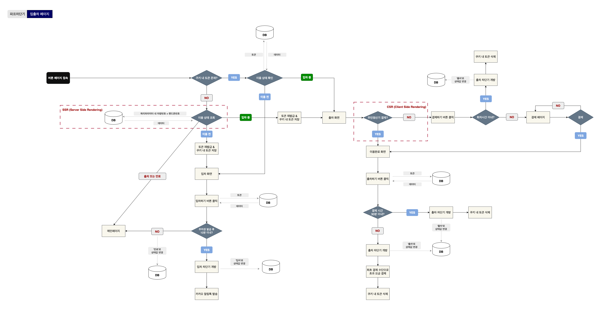

# 💡 UX 이슈는 기술로 풀 수 있다

🤬: "QR 다시 찍었는데 출차가 안 돼요", "왜 계속 홈화면만 나와요?"  
실제 사용자들이 겪는 불편은 반복되고 있었고, 그 원인은 구조 자체의 한계에 있었습니다.

이 프로젝트는 단순 기능 수정이 아닌 **Next.js 기반 SSR 구조 전환, 쿠키 인증 방식 재설계, A2HS 설치 유도 흐름 설계**를 통해
<u>문제의 근본 원인을 기술적으로 해결하고, 사용자 흐름 자체를 구조적으로 재설계한 리팩토링 사례입니다.</u>

## 입출차 플로우 차트



## 동작 예시 (GIF)

### 주차권-OTK(One Time Key) 발급 시뮬레이션

```
[홈페이지] → [이용정보 입력] → [주차권 발급] → [입차] → [차단기 열림]
```


### 결제 및 출차 시뮬레이션

```
[알림톡 수신] → [출차 시도] → [결제] → [이용완료 화면] → [출차] → [차단기 열림] → [홈으로 이동]
```


## Phase 1. 출차가 안돼요, 계속 홈화면만 보여요

### 민원의 시작: "QR 다시 찍었는데 출차가 안돼요"

🙋🏻‍♂️: "출차 페이지가 안보여요"  
🙋🏻: "아까는 됐는데 지금은 안돼요"  
🙋🏻‍♀️: "왜 홈화면만 보여줘요?"

주차장 이용이 끝나면 대부분의 사용자는 다시 QR을 스캔하여 출차 페이지에 진입하려고 합니다.

하지만..  
이때 웹앱은 출차 페이지가 아닌 홈화면만 보여주고, 아무런 동작도 하지 않으니 사용자 입장에서는 당황할 수밖에 없었습니다.

입차 시 발급된 토큰은 쿠키에 저장되지만, **브라우저 변경·웹뷰 전환·다기기 사용 등 다양한 상황에서 이 쿠키는 더 이상 유효하지 않게 되고** 이로 인해 출차 페이지에 진입할 수 없는 문제가 반복되고 있었습니다.

사실 기존 CSR 구조에서는 이를 해결하기 위해 아래와 같은 안내를 홈화면에서 제공하고 있었습니다:

> 이용 중인 주차권이 보이지 않는다면, 아래 재발급 버튼을 눌러 주차권을 다시 발급받아주세요.  
> [주차권 재발급 버튼]

하지만..  
대부분의 사용자는 이 안내를 인지하지 못했고, 결국 **쿠키 기반 인증 구조의 한계가 전체 UX를 막고 있었습니다.**

## Phase 2. 인증을 구조로 보완한다 - SSR + 쿼리 기반 복원 흐름

### 👩🏻‍💻 그래서!

출차 시점에도 서버가 차량 정보를 직접 복원할 수 있도록 **Next.js SSR 구조로 전체 흐름을 재설계**했습니다.

- 쿼리 기반 라우팅으로 `carno`, `phoneno` 전달
- getServerSideProps() 에서 차량 정보 조회 및 주차 상태 확인
- 아직 출차 전이라면 → 서버에서 자동 토큰 재발급
- 이후 CSR에서는 결제 여부만 확인하면 끝!

<details>
<summary><strong> 👀 핵심 코드 자세히보기 (SSR)</strong></summary>

#### [SSR - getServerSideProps]

- 쿠키 존재: JWT 토큰 유효성 검증 → 출차 상태이면 홈('/')으로 리다이렉션
- 쿠키 없음: 쿼리 데이터 기반으로 사용 이력 조회 및 토큰 재발급 처리
- 데이터가 없거나 오류일 경우 /error 페이지로 리다이렉션
- SSR에서 처리한 결과는 btnInfo props로 전달

```ts
// SSR에서 토큰 상태 체크 및 props 전달

export const getServerSideProps: GetServerSideProps = async (
  context: GetServerSidePropsContext
) => {
  // 쿠키 내 토큰이 있는지 확인
  const tokenResult = await checkToken(context);

  // 토큰 사용 유효함
  if (tokenResult.status === 'VALID') {
    return {
      props: {
        btnInfo: tokenResult,
      },
    };
  }

  // 토큰 없음
  const { carno, phoneno } = context.query;

  try {
    const usageData = await getUsageList({ car_number: carno, phone_number: phoneno, ... });

    if (
      usageData.parkingitem_status === 'PARK_IN' ||
      usageData.parkingitem_status === 'CREATED'
    ) {
      // 유효 주차 정보 존재 시 토큰 재발급
      const token = await reissueToken({...});
      return {
        props: {
          btnInfo: {
            ...usageData,
            token: token,
          },
        },
      };
    } else {
      ...
    }
  }
```

</details>

## Phase 2.5. 다시 QR 찍지 마세요 - 알림톡으로 출차 유도

SSR 구조를 도입하더라도 `carno`와 `phoneno` 쿼리가 없다면 아무것도 할 수 없습니다.

### 👩🏻‍💻 그래서!

사용자가 QR을 다시 찍지 않아도 출차 시점에 자동으로 출차 페이지에 진입할 수 있도록 알림톡에 딥링크를 담아 전송했습니다.

- 입차가 완료 시 자동으로 알림톡 발송
- 메시지 내 출차 바로가기 링크 포함  
  예) https://example.com/button?carno=xxx&phoneno=yyy
- 사용자는 알림톡만 눌러도 출차 페이지로 바로 진입가능

```ts
const body = {
  receiver: btnInfo.phone_number,
  content: `차량번호: ${btnInfo.car_number}님, 입차 완료되었습니다. ...`,
  btn: `https://[domain]/button?carno=${carNo}&phoneno=${phoneNo}`,
};
```

## Phase 3. 무인정산기에서 결제하셨어요?

이제 사용자는 알림톡 내 출차하기 버튼을 클릭하거나 QR을 다시 스캔하면,  
<u>더 이상 어떤 버튼도 누를 필요 없이</u> 결제 여부가 자동으로 판단되고 이후 흐름은 전부 시스템에 의해 처리됩니다.

1. SSR 단계에서 토큰 여부 확인 또는 토큰 복원
2. CSR에서 결제 여부 확인
3. 결제 상태에 따라 자동 분기

```ts
useEffect(() => {
  saveCookie(name, token); // 토큰 쿠키 저장
  handleCheckPaidStatus(); // 무인정산기 결제 여부 판단 후 분기
}, [btnInfo]);
```

```ts
// 결제 완료 여부 확인 후 페이지 이동
const checkPaid = await checkPaidStatus(token);

if (checkPaid !== null) {
  router.push('/button/complete'); // 출차 완료 페이지로 이동
} else {
  router.push('/payment'); // 결제 페이지로 이동
}
```

이 흐름은 복잡했던 "출차 버튼 → 결제 여부 확인 → 결제 페이지 → 버튼 페이지 재진입"의 기존 구조를  
"출차 페이지 진입 즉시 판단" 흐름으로 단순화하며 **사용자 액션을 3단계에서 1단계로 줄이는 명확한 UX 개선을 이뤄냈습니다.**

## Phase 4. 매일 사용하는데 왜 매번 QR을 찍어야 하죠?

입차전용권 사용자의 출차 문제를 해결한 뒤 다음 과제로 남은 건 <u>**정기권 사용자의 진입 방식 개선**</u>이었습니다.  
정기권 사용자는 하루에 한 번 혹은 그 이상 웹앱을 사용하지만 **여전히 매번 QR을 다시 찍거나 URL을 직접 입력하며 접속**하고 있었죠.

> "🧐 앱처럼 홈 화면에서 바로 열리게 만들 수 없을까?"  
> "브라우저를 거치지 않고, 앱처럼 홈 화면에서 바로 실행되면 좋을텐데..."

### 👩🏻‍💻 그래서!

기존에는 정기권 발급 시 <u>"홈 화면에 추가해서 사용해주세요"</u> 라는 안내를 함께 제공했습니다.

## Phase 4.5. 👴🏻 홈 화면 추가가 뭐야?

하지만 **"홈 화면 추가"라는 개념 자체가 익숙하지 않은 고령 사용자들에게는 어렵고 낯선 작업**이었습니다.  
결국 대부분의 사용자가 안내에 따라 실행하지 못했고, QR 재스캔과 URL 주소 입력을 반복하는 불편은 그대로 남았습니다.

> "🧐 설치 방법을 설명하기보다 **직접 설치하도록 유도할 수는 없을까?**"  
> "버튼 한 번으로 추가되는 방식이라면 누구나 쓸 수 있지 않을까?"

## Phase 5. 설치 유도 흐름 만들기 - A2HS(Add to Home Screen)

### 👩🏻‍💻 그래서!

A2HS를 사용하여 브라우저가 홈화면 추가 조건을 만족할 때 `beforeinstallprompt` 이벤트를 통해 사용자에게 설치를 유도할 수 있는 흐름을 만들었습니다.

1. 사용자가 정기권 페이지에 진입
2. 브라우저가 설치 가능한 조건을 충족하면 `beforeinstallprompt` 이벤트 발생
3. 해당 이벤트를 `커스텀 훅(useA2HS Hook)` 으로 잡아 상태로 보관
4. 조건 만족 시 `설치 유도 모달`을 노출
5. 사용자가 설치를 수락하면 `prompt()` 실행하여 홈 화면에 추가
6. 거부한 경우에는 localStorage에 일정기간 숨김 처리

<details>
<summary><strong> 👀 핵심 코드 보기(간단 요약)</strong></summary>

### 1. 이벤트 감지 및 상태 저장 - useA2HS.ts

```ts
export default function useA2HS() {
  const [deferredPrompt, setDeferredPrompt] =
    useState<BeforeInstallPromptEvent | null>(null);

  const install = () => {
    if (!deferredPrompt) return;
    deferredPrompt.prompt(); // 설치 창 띄우기
    deferredPrompt.userChoice.then(() => setDeferredPrompt(null));
  };

  useEffect(() => {
    const handler = (e: BeforeInstallPromptEvent) => {
      e.preventDefault(); // 브라우저 자동 배너 막기
      setDeferredPrompt(e); // 수동으로 유도할 수 있도록 상태 저장
    };

    window.addEventListener('beforeinstallprompt', handler as any);
    return () =>
      window.removeEventListener('beforeinstallprompt', handler as any);
  }, []);

  return { deferredPrompt, install };
}
```

### 2. 설치 모달 노출 조건 - utils/a2hs.ts

```ts
export const isValidateHideInstallA2HS = () => {
  return Number(localStorage.getItem('hide_install_a2hs')) > Date.now();
};

export const setHideInstallA2HS = () => {
  const afterWeek = Date.now() + 7 * 24 * 60 * 60 * 1000;
  localStorage.setItem('hide_install_a2hs', String(afterWeek));
};
```

### 3. 실제 설치 모달 - components/A2HS.tsx

```ts
  // 조건 1: 이벤트 없음 / 조건 2: 일주일 숨김 상태
  if (!deferredPrompt || isValidateA2HS()) return null;

  return (
    <Modal>
      <H4>바로가기 추가</H4>
      <ModalP>홈화면에 추가하시겠어요?</ModalP>
      <CancelBtn
        onClick={
          setInstallA2HS(); // 7일간 숨김
          clearPrompt(); // 현재 프롬프트 초기화
        }
      >아니오</CancelBtn>
      <ApplyBtn
        onClick={
          install();
        }
      >추가하기</ApplyBtn>
    </Modal>
  );
```

</details>

## 마무리: 흐름 중심의 UX 리팩토링, 그 이후

이 프로젝트는 단순한 기능 수정이 아닌 **반복적으로 발생하던 사용자 불편을 기술적 설계로 해결한 리팩토링 과정**이었습니다.

제가 수정한 것은 복잡한 기능이 아니라 사용자가 서비스를 이용하며 따라가는 '흐름'이었습니다.  
그리고 그 흐름을 기술적으로 재설계하자 UX 문제는 자연스럽게 해결되었습니다.

_SSR 구조 전환, 쿼리 기반 복원, 알림톡 딥링크 설계, A2HS 설치 유도 등_  
이 모든 흐름은 기술만으로 해결된 것이 아니라 **사용자의 실제 문제를 구조적으로 풀어내기 위한 설계**에서 출발했습니다.
이 일련의 과정을 통해 **UX 문제는 새로운 기능을 추가하는 것이 아니라 때로는 기존의 흐름과 구조를 재설계하는 것만으로도 해결될 수 있음을 확인할 수 있었습니다.**

📈 리팩토링 이후 실제 변화

- 입출차 관련 민원 **0건 달성** (개선 이후 ~ 현재)
- 정기권 사용자 기준 웹앱 **이탈률 약 35% 감소**
- 시스템 개선 이후 웹앱 **사용률 약 30% 증가**
  (2024.04 → 2024.10: 일평균 83건 → 108건)

## 📎 Appendix: 상세 기술 흐름 & 프로젝트 구조

| 구분          | 내용                                                |
| ------------- | --------------------------------------------------- |
| 프론트엔드    | Next.js (SSR), React, TypeScript, styled-components |
| 백엔드        | Node.js, Express, TypeScript                        |
| DB            | MySQL + Sequelize ORM                               |
| 인증          | JWT 기반 토큰 발급 및 검증                          |
| 외부 연동     | 행안부 차량 정보 API, 카카오 알림톡                 |
| 하드웨어 제어 | HTTP API 방식 차단기 제어                           |

## 프로젝트 구조

```
📁 barrier-system/
├── back/                  # 백엔드
│   ├── controller/        # 핵심 컨트롤러 (token, barrier 등)
│   ├── middleware/        # JWT 인증 처리
│   ├── model/             # Sequelize 모델
│   ├── routes/            # API 라우터
│   ├── utils/             # 공통 유틸
│   └─  ...
├── src/                   # 프론트엔드
│   ├── pages/             # Next.js 페이지
│   ├── container/         # 각 페이지 로직
│   ├── components/        # UI 컴포넌트
│   ├── utils/             # 프론트 API 유틸 함수
│   └─  ...
├── .env
├── app.ts                 # Express 서버 엔트리
├── package.json
├── ...

```

<details> <summary><strong>기능 흐름 요약 (API 중심)</strong></summary>

### 1. 토큰(OTK)발급 - (POST /v1/token)

**📌 사용자가 차량번호와 전화번호를 입력하면 서버는 주차권(One-Time-Key)을 JWT 형태로 발급합니다.**
감면 대상 여부는 행안부 API를 통해 조회되며 발급된 토큰은 쿠키에 저장되어 인증에 사용됩니다.

**[프론트]**

1. 차량번호 + 전화번호 입력
2. `getReduction()`으로 감면 대상 여부 확인 (행안부 API 연동)
3. 감면 유형과 함께 `/v1/token` 호출 → JWT 발급
4. 쿠키에 토큰 저장 후 `/button` 페이지로 이동

**[백엔드]**

```ts
// 중복 주차권 존재 여부 확인
await Parking.findAll({
  where: {
    car_number: car_number,
    phone_number: phone_number,
    parking_status: {
      [Op.in]: ['CREATED', 'PARK_IN'],
    },
  },
});

// 새로운 주차권 발급 - JWT 생성
const token = jwt.sign({ ...parkingInfo }, process.env.JWT_KEY);
```

### 2. 차단기 제어 - POST /v1/barrier

📌 사용자가 ‘입차’ 또는 ‘출차’ 버튼을 누르면 서버는 **JWT를 통해 유효성을 검증한 후 HTTP API를 통해 실제 barrier(하드웨어)를 열고**,  
DB에 주차 상태를 업데이트합니다.

```ts
// 차단기 OPEN
await axios.post(`http://${하드웨어 url}`,
{
  action: 'open',
}, {
  headers: { Authorization: 'Bearer [하드웨어 고정 키]' }
}
);

// cmd 에 따른 주차 상태값 변경
await Parking.update({ parking_status: 'PARK_IN' | 'PARK_OUT' });
```

### 3. 출차 처리

📌 사용자의 **감면 유형에 따라 요금을 계산**하고 회차시간 이내일 경우 차단기를 열고,
요금이 있을 경우 결제 페이지로 리다이렉션합니다.

```ts
// 감면유형에 따라 요금 계산
const finalFee = btnInfo.reduction_type === 'GENERAL' ? fee : fee / 2;

if (finalFee === 0) {
  handleBarrier('exit');
} else {
  router.push(`/payment/${finalFee}`);
}
```

```ts
// 출차 완료시 쿠키 내 token 삭제 → 홈 이동
const res = await handleBarrier('exit', btnInfo.token);

if (res.result === 'PF_200') {
  deleteCookie(name);
  return router.push('/');
}
...
```

</details>
